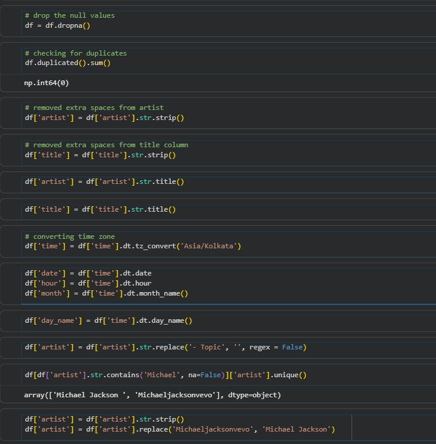
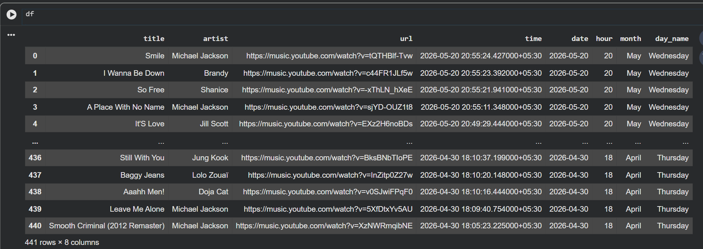
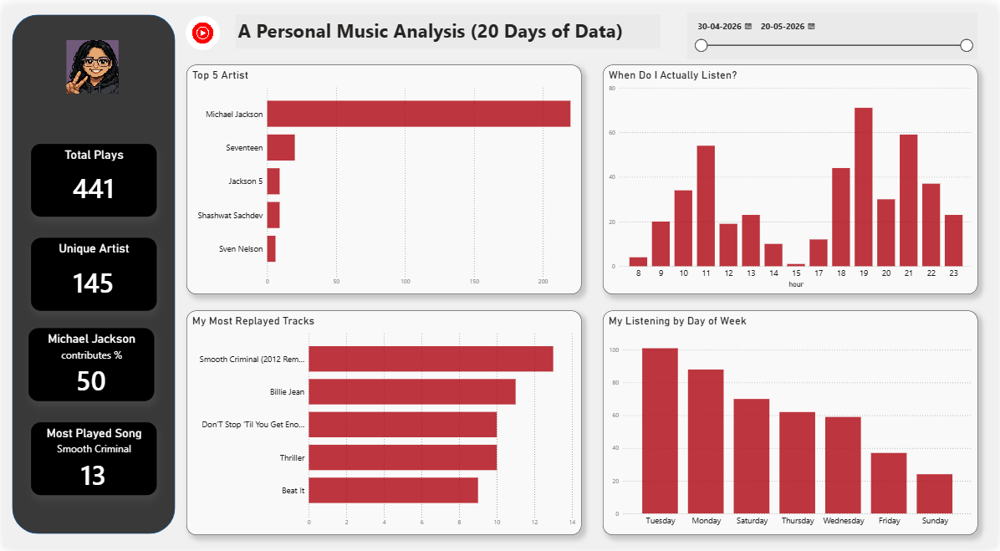

# Streaming Behavior and Listening Pattern Analysis
My personal music listening analysis using python(pandas) for data cleaning and analysis , Power BI  for visualization.
---

## Project Overview

Instead of using a random dataset, I analyzed my own YouTube Music listening history exported from Google Takeout.

This project helped me learn data analysis through real-world messy data, from cleaning JSON files in Pandas to building an interactive Power BI dashboard.

### Workflow

Extract → Clean → Transform → Analyze → Visualize

### What I Worked On

* Cleaned and transformed raw listening history using Pandas
* Performed exploratory analysis on listening patterns and behavior
* Identified top artists, songs, peak listening hours, and trends
* Built an interactive Power BI dashboard for visualization

### Tools & Technologies

* Python (Pandas)
* Google Colab
* Power BI
* Google Takeout

## Dataset Overview

**Source:** Google Takeout — YouTube Music listening history  
**Format:** JSON → cleaned to CSV  
**Records:** 441 plays  
**Period:** 30 April 2026 – 20 May 2026  

Google Takeout exports your YouTube Music history as a JSON file. Each record 
contains the song title, artist name, URL, and the timestamp of when you played it.

I uploaded the JSON file directly into Google Colab and loaded it using Python's 
built-in `json` library, then converted it into a Pandas DataFrame for analysis.

---

## Data Cleaning

**Filtering records**
The JSON had both YouTube and YouTube Music history mixed together. I filtered 
only Music entries using the `header` field in each record.

**Fixing titles**
Every title came with a "Watched " prefix. Removed it using `.str.replace()` 
so only the actual song name remained.

**Dropping nulls**
11 rows had no title or artist — just a URL. Google didn't export metadata for 
these entries so I dropped them, leaving 441 clean records.

**Fixing artist names**
Trailing spaces were causing the same artist to appear twice. Used `.str.strip()` 
to fix this. Also found `Michaeljacksonvevo` and `Machaei Jackson` as separate 
entries — replaced both with `Michael Jackson` using `.replace()`.

**Timezone conversion**
Timestamps were in UTC by default. Since I'm in India (IST = UTC +5:30), a song 
played at 6 AM in the data was actually played at 11:30 AM. Converted the full 
time column to IST using `dt.tz_convert('Asia/Kolkata')`.

**Extracting time features**
Extracted `date`, `hour`, `day_name`, and `month` from the timestamp column 
separately for time-based analysis.

---

## Executive Summary & Insights

441 plays across 20 days revealed some clear patterns in my listening behavior 
that I wouldn't have noticed otherwise.

1. **Listening is heavily concentrated on one artist**

50% of all my plays were Michael Jackson, 220 out of 441 plays. The remaining 
50% was spread across 144 other artists. I knew I liked his music but didn't 
realize half my listening time was just him.

2. **Two clear peaks in my day**

My listening spikes at two specific times, around 11 AM and again at 7-8 PM. 
The afternoon hours between 3-6 PM are almost completely silent. My music 
clearly follows my daily routine without me consciously planning it.

3. **Weekdays dominate, weekends drop off**

Tuesday is my most active listening day with 101 plays. Listening drops 
consistently through the week and hits its lowest on Sunday with around 18 plays. 
Weekdays account for the majority of my total listening.

4. **A small set of songs on repeat**

My top 5 songs — Smooth Criminal, Billie Jean, Don't Stop Til You Get Enough, 
Thriller, and Beat It, are all Michael Jackson. Smooth Criminal alone was played 
13 times in 20 days.

**Summary**

| Metric | Value |
|--------|-------|
| Total Plays | 441 |
| Unique Artists | 145 |
| Most Played Artist | Michael Jackson (50%) |
| Most Replayed Song | Smooth Criminal (13 plays) |
| Peak Listening Hour | 7–8 PM |
| Most Active Day | Tuesday |

## Files

| File | Description |
|------|-------------|
| `yt_music_proj.ipynb` | Google Colab notebook — data extraction, cleaning and analysis 
| `Personal_YT_music_analysis.pbix` | Power BI template file |
